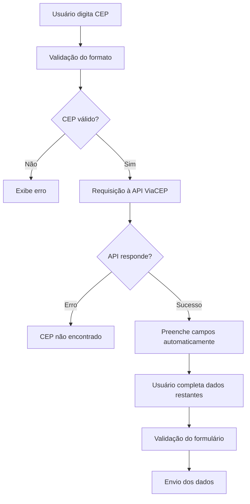

# 🏠 Sistema de Consulta CEP - Formulário de Endereço

## 📋 Descrição

Sistema completo de formulário de endereço com integração à **API ViaCEP** para consulta automática de informações de endereço a partir do CEP. Desenvolvido com **HTML5**, **CSS3**, **JavaScript** e **Bootstrap 5**.

## ✨ Funcionalidades

### 🔍 **Consulta Automática de CEP**
- Integração com API ViaCEP (https://viacep.com.br/)
- Preenchimento automático de: Logradouro, Bairro, Cidade e Estado
- Validação em tempo real do formato do CEP
- Máscara automática no campo CEP (00000-000)
- Feedback visual durante a busca (loading spinner)

### 📝 **Formulário Completo**
- **Dados Pessoais:** Nome completo e e-mail
- **Endereço Completo:** CEP, logradouro, número, complemento, bairro, cidade, estado
- **Validação:** Campos obrigatórios com feedback visual
- **Termos:** Checkbox para aceite de termos e condições

### 🎨 **Interface Moderna**
- Design responsivo com Bootstrap 5
- Gradiente personalizado no background
- Animações CSS suaves
- Ícones Font Awesome
- Tooltips informativos
- Feedback visual colorido (verde/vermelho)

### 🔧 **Funcionalidades Técnicas**
- Validação client-side em JavaScript
- Estrutura orientada a objetos (Classes ES6)
- Tratamento de erros da API
- Código limpo e bem documentado
- Compatibilidade com navegadores modernos

## 📁 Estrutura do Projeto

```
formsProjeto/
├── 📄 index.html          # Estrutura HTML principal
├── 🎨 style.css           # Estilos CSS personalizados
├── ⚙️ script.js           # Lógica JavaScript (API ViaCEP)
├── 📝 README.md           # Documentação do projeto
└── 🗃️ css.html            # Arquivo auxiliar
```

## 🚀 Como Executar

### **Método 1: Abrir Diretamente**
1. Clone ou baixe o projeto
2. Abra o arquivo `index.html` no navegador
3. O sistema estará pronto para uso!

### **Método 2: Via Terminal (Windows)**
```bash
# Navegar até o diretório
cd "C:\Users\Tamires Porto\Documents\formsProjeto"

# Abrir no navegador
start index.html
```

### **Método 3: Servidor Local (Opcional)**
```bash
# Python
python -m http.server 8000

# Node.js (npx)
npx serve .

# Acesse: http://localhost:8000
```

## 🔧 Tecnologias Utilizadas

### **Frontend**
- **HTML5:** Estrutura semântica moderna
- **CSS3:** Estilos avançados com Flexbox/Grid
- **JavaScript ES6+:** Programação orientada a objetos
- **Bootstrap 5.3.2:** Framework CSS responsivo

### **APIs e CDNs**
- **ViaCEP API:** Consulta de endereços brasileiros
- **Font Awesome 6.4.0:** Biblioteca de ícones
- **Google Fonts:** Fonte Inter personalizada
- **Bootstrap CDN:** Framework via CDN oficial

### **Recursos Avançados**
- **Fetch API:** Requisições HTTP modernas
- **Async/Await:** Programação assíncrona
- **LocalStorage:** Armazenamento local (futuro)
- **CSS Variables:** Variáveis CSS personalizadas
- **CSS Animations:** Animações suaves

## 📱 Responsividade

O sistema é **totalmente responsivo** e se adapta a:

- 📱 **Mobile:** Smartphones (< 768px)
- 📟 **Tablet:** Tablets (768px - 992px)
- 💻 **Desktop:** Computadores (> 992px)
- 🖥️ **Widescreen:** Telas grandes (> 1200px)

## 🔍 Como Usar o Sistema

### **1. Preenchimento do CEP**
```
Digite o CEP no formato: 01234-567 ou 01234567
O sistema aplicará a máscara automaticamente
```

### **2. Busca Automática**
```
Ao sair do campo CEP (blur) ou pressionar Enter:
→ Sistema valida o formato
→ Faz requisição à API ViaCEP
→ Preenche os campos automaticamente
→ Mostra feedback de sucesso/erro
```

### **3. Validação do Formulário**
```
Campos obrigatórios (*):
✓ Nome Completo
✓ E-mail
✓ CEP
✓ Logradouro (preenchido automaticamente)
✓ Número
✓ Bairro (preenchido automaticamente)
✓ Cidade (preenchida automaticamente)
✓ Estado (preenchido automaticamente)
✓ Aceite dos Termos
```

## 🔄 Fluxo de Funcionamento



## 📊 API ViaCEP

### **Endpoint Utilizado**
```
GET https://viacep.com.br/ws/{CEP}/json/
```

### **Exemplo de Resposta**
```json
{
  "cep": "01310-100",
  "logradouro": "Avenida Paulista",
  "complemento": "",
  "bairro": "Bela Vista", 
  "localidade": "São Paulo",
  "uf": "SP",
  "ibge": "3550308",
  "gia": "1004",
  "ddd": "11",
  "siafi": "7107"
}
```

### **Tratamento de Erros**
```json
{
  "erro": true
}
```

## 🎨 Customização

### **Cores (CSS Variables)**
```css
:root {
    --primary-color: #007bff;    /* Azul principal */
    --success-color: #28a745;    /* Verde sucesso */
    --danger-color: #dc3545;     /* Vermelho erro */
    --warning-color: #ffc107;    /* Amarelo aviso */
}
```

### **Modificar Validações**
```javascript
// Em script.js - Método validateCEP()
validateCEP(cep) {
    const cleanCEP = cep.replace(/\D/g, '');
    return /^[0-9]{8}$/.test(cleanCEP);
}
```

## 🔐 Segurança e Boas Práticas

- ✅ **Validação Client-side:** Validação em tempo real
- ✅ **Sanitização:** Limpeza de dados de entrada
- ✅ **Tratamento de Erros:** Feedback adequado ao usuário
- ✅ **HTTPS:** API ViaCEP utiliza HTTPS
- ✅ **Escape HTML:** Prevenção de XSS
- ✅ **Accessibility:** Labels e ARIA adequados

## 🐛 Resolução de Problemas

### **CEP não encontrado**
```
Problema: API retorna erro
Solução: Verificar se o CEP existe e está no formato correto
```

### **Campos não preenchidos automaticamente**
```
Problema: Requisição falha
Solução: Verificar conexão com internet e console do navegador
```

### **Validação não funciona**
```
Problema: JavaScript não carrega
Solução: Verificar se script.js está no mesmo diretório
```

## 📈 Melhorias Futuras

- [ ] **Backend Integration:** Integração com servidor
- [ ] **Database:** Armazenamento de dados
- [ ] **Authentication:** Sistema de login
- [ ] **PWA:** Progressive Web App
- [ ] **Offline Mode:** Funcionamento offline
- [ ] **Multiple CEPs:** Busca de múltiplos CEPs
- [ ] **Geolocation:** Localização automática
- [ ] **Maps Integration:** Integração com mapas

## 👨‍💻 Contribuição

Para contribuir com o projeto:

1. **Fork** o repositório
2. **Clone** sua fork
3. **Crie** uma branch para sua feature
4. **Commit** suas mudanças
5. **Push** para a branch
6. **Abra** um Pull Request


## 📄 Licença

Este projeto está sob a licença **MIT**. Veja o arquivo `LICENSE` para mais detalhes.

---

**Desenvolvido com ❤️ por Tamires Porto utilizando HTML5, CSS3, JavaScript e Bootstrap 5**

*Última atualização: Outubro 2025*
